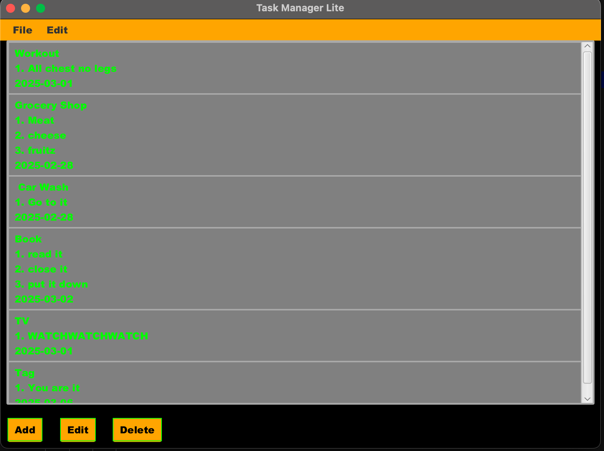
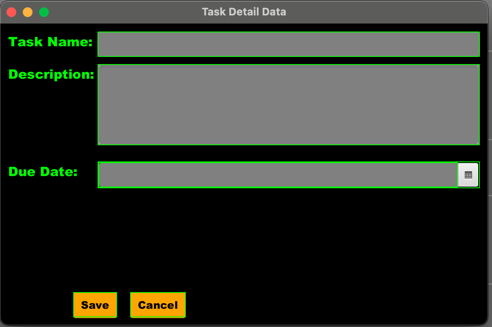

# Task Manager Lite

## Inspiration
The inspiration behind Task Manager Lite arose from the need for a simple and efficient task management application that helps organize simple tasks and (hopefully) increase productivity!

## Vision
My vision was and is to create a lightweight, user-friendly task manager that allows users to easily create new task lists, add, edit, save, and delete tasks while providing a visually appealing high-contrast interface. This is version 1.0.0 of my Task Manager Lite application. I will add to this over time to explore what JavaFX is able to create!

## Basic Functionality
- Menu with File and Edit, each having a drop-down menu.
- Menu - "File" options include the function to make a new list, save the changes, and exit the program.
- Menu - "Edit" options include the function to add tasks (Making a new list will discard the old list!), edit tasks, or delete a task.
- Add new tasks with name, description, and due date - In a separate window called "Task Detail Data".
- Edit existing tasks.
- Save tasks to a file.
- Load tasks from a file.
- Delete tasks.

## How to Use

1. **File Menu**:
    - **New (Ctrl+N)**: Click "File" and select "New" to clear the current list and start a new one.
    - **Save (Ctrl+S)**: Click "File" and select "Save" to save your current tasks to a file.
    - **Exit (Ctrl+Q)**: Click "File" and select "Exit" to close the application.

2. **Edit Menu**:
    - **Add Task (Ctrl+A)**: Click "Edit" and select "Add Task" to open the task detail window and enter task details.
    - **Edit Task (Ctrl+E)**: Click "Edit" Select a task from the list, then click "Edit Task" to modify the selected task.
    - **Delete Task (Ctrl+D)**: Click "Edit" Select a task from the list, then click "Delete Task" to remove the selected task.

3. **Main Window**:
    - **Add Task**: Click the "Add" button to open the task detail window and enter task details.
    - **Edit Task**: Select a task from the list and click the "Edit" button to modify the selected task.
    - **Delete Task**: Select a task from the list and click the "Delete" button to remove the selected task.

4. **Task Detail Data Window**: This secondary window opens automatically when the "Add" button or (Ctrl + A) are selected by the user, allowing them to create a task with:
    - **Task Name**: User text field to input the general name of the task at hand. For example: A trip to the grocery store can be named "Grocery".
    - **Description**: User text area to input the details (enumerated or not) needed to be completed. For example: A trip to the grocery store might need a list like "1. Meat\n2. Cheese\n...".
    - **Due Date**: User date picker field, user can NOT input their own due date in the field, must use the "calendar" icon/button directly to the right of the field to select a formatted due date (more reliable for data persistence).
    - **Save**: IMPORTANT - Make sure you click "Save." When the user has input data into any of the fields, the save button at the bottom of the "Task Detail Data" window will save the work, add it to the task list, and automatically close the Task Detail Data window.
    - **Cancel**: If the user decides they do not need to add a task, in the Task Detail Data window, click on "Cancel" to close the window and return to the main window with the list of tasks.

5. **Task Management**:
    - **Save Tasks**: Click the "Save" menu item under "File" or use the keyboard shortcut (Ctrl+S) to save the added tasks to a file.
    - **Load Tasks**: Tasks are automatically loaded when the application starts.
    - **Add Task**: Click the "Add" button or use the "Add Task" menu item (Ctrl + A) to open the task detail window and enter task details.
    - **IMPORTANT**: When you click "Add" (Ctrl + A) to add a new task, or when you click to "Edit" (Ctrl + E) a task, you must go to "File" and select "Save" (Ctrl + S) to update the task list and ensure it remains in the list the next time you launch the app.

## Functionality Implemented vs. Under Construction

- **Implemented**:
    - Task addition, editing, saving, and deletion.
    - Custom CSS styling.
    - Basic data persistence via text file.

- **Under Construction - To be added at a later date**:
    - Export task-list to .csv file.
    - Fine-tuning CSS styling - the pop up calendar in task detail data window is not exactly perfect-looking (background is white when it should be grey or black for high contrast) but functions just fine.
    - Implementing more robust user feedback by adding input validity fields for text input.
    - Implementing a better system for data persistence rather than a text file.

## Screenshots

## Project Structure
The project follows a straightforward MVC-like pattern with controllers managing the interactions and the user interface defined in FXML files.

### Files and Directories
- `src/main/java/edu/au/cpsc/module7/`: Contains the main application file and controllers.
    - `RyanTaskManagerApplication.java`: The main application class that starts the JavaFX application.
    - `controller/`: Contains the controllers for handling UI interactions.
        - `RyanMainController.java`: Controller for the main view.
        - `TaskDetailController.java`: Controller for the task detail view.
- `src/main/resources/edu/au/cpsc/module7/`: Contains the FXML files and CSS stylesheets.
    - `Main-View.fxml`: Defines the layout of the main window.
    - `TaskDetail.fxml`: Defines the layout of the task detail window.
    - `main.css`: Stylesheet for the main window.
    - `detail.css`: Stylesheet for the task detail window.

## Requirements
- **Java**: JDK 11 or higher.
- **JavaFX**: JavaFX SDK 11 or higher.
- **Maven**: To build and manage dependencies.

